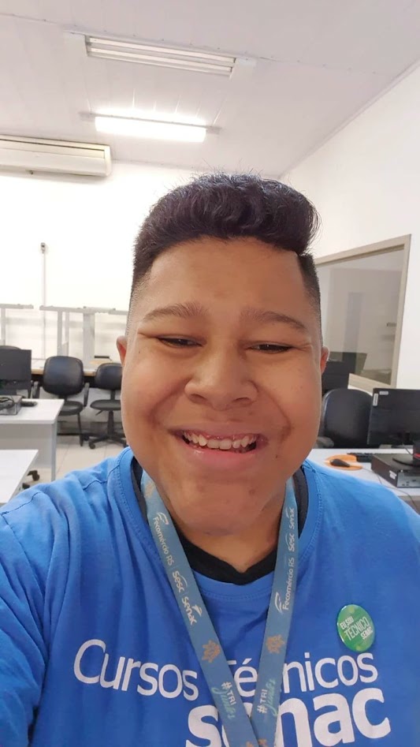

# 💎 JOIA

### Inteligência artificial a serviço de uma aprendizagem mais humana

**Educação · Programação · Acompanhamento · Autonomia**

---

## Sobre o projeto

A **JOIA** é uma assistente educacional criada para apoiar estudantes em suas
experiências com programação e inteligência artificial. Mais do que entregar
respostas, o projeto busca transformar dúvidas em oportunidades de aprendizado,
conduzindo cada aluno por um caminho de investigação, reflexão e descoberta.

Sua proposta combina a agilidade da IA com uma orientação pedagógica próxima.
Cada conversa considera o contexto do estudante e favorece explicações graduais,
pistas e perguntas que estimulem o raciocínio — sem substituir o processo de
aprender.

## Propósito

O projeto nasceu do desejo de tornar o uso da inteligência artificial em sala de
aula mais **consciente, orientado e significativo**. A JOIA procura ajudar o
estudante a desenvolver autonomia, ao mesmo tempo que oferece ao professor uma
visão mais clara de sua trajetória.

Seus princípios são:

- **orientar antes de responder**, valorizando a construção do conhecimento;
- **respeitar o ritmo de cada estudante**, reconhecendo diferentes formas de
  aprender;
- **incentivar a curiosidade**, a experimentação e o pensamento crítico;
- **aproximar professor, aluno e tecnologia** sem perder o cuidado humano;
- **acompanhar a evolução**, fazendo de cada tentativa uma parte importante da
  aprendizagem.

## Uma experiência de acompanhamento

A JOIA mantém cada jornada de aprendizagem organizada individualmente. Ao longo
das conversas, ela reúne elementos que ajudam a compreender dúvidas, avanços e
pontos que ainda merecem atenção.

Esse acompanhamento permite que a inteligência artificial atue como apoio ao
estudo, enquanto o olhar do educador continua no centro das decisões
pedagógicas. Assim, tecnologia e docência trabalham juntas para oferecer uma
orientação mais intencional e próxima.

## Versionamento

O projeto utiliza **Git** para registrar sua história e preservar a evolução de
cada etapa. As versões públicas seguem uma numeração simples e progressiva,
facilitando a identificação de mudanças relevantes na experiência, nas
orientações pedagógicas e nos recursos de acompanhamento.

> **Versão atual: 1.7**

Cada nova versão representa um ciclo de aperfeiçoamento. Mais do que adicionar
funcionalidades, o objetivo é refinar a qualidade das interações, a segurança
dos fluxos e a coerência da proposta educacional.

## Desenvolvedor

### João Carlos de Moura dos Santos

[Conheça seu perfil no LinkedIn](https://www.linkedin.com/in/joaocarlosms/)

Professor do **SENAC de Ijuí**, João Carlos de Moura dos Santos desenvolveu a
JOIA a partir de seu interesse em acompanhar de maneira mais orientada os alunos
em suas aventuras com a inteligência artificial.

Sua iniciativa parte da convicção de que a IA pode ampliar possibilidades na
educação quando utilizada com propósito, mediação e responsabilidade. A JOIA é,
portanto, um encontro entre prática docente, tecnologia e o compromisso de
ajudar estudantes a aprender com mais confiança e autonomia.

---

**JOIA** — aprender com tecnologia, crescer com orientação.

